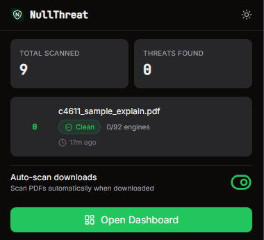
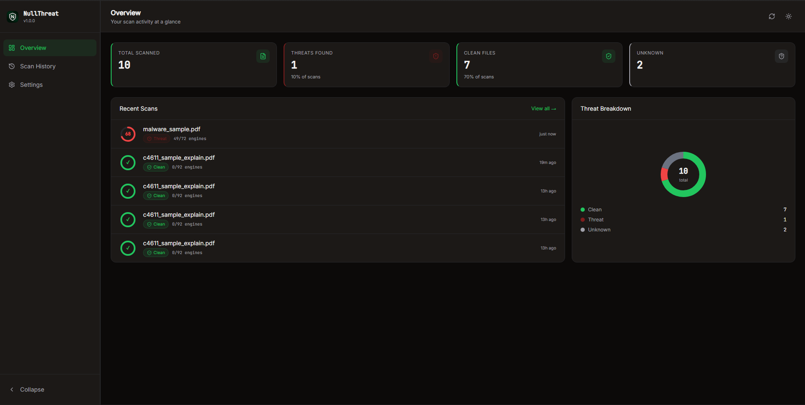
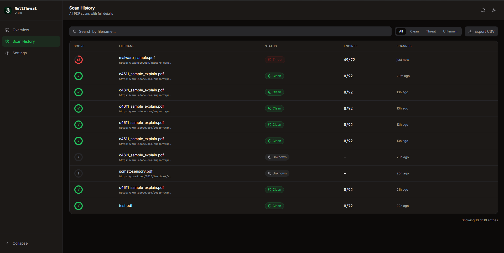
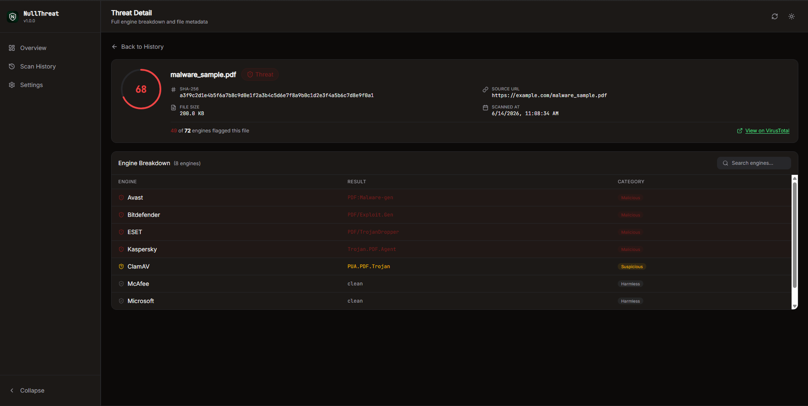
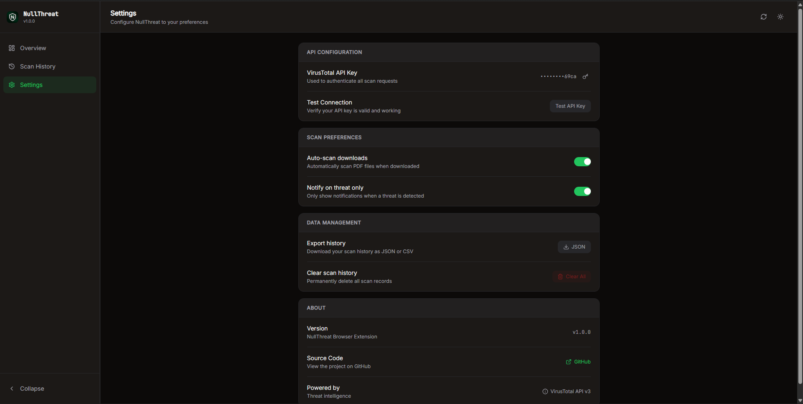

# NullThreat

> A professional-grade browser extension that automatically scans PDF downloads against VirusTotal's 90+ threat intelligence engines, delivering real-time threat scores and detailed engine breakdowns directly in your browser.


---

## Screenshots

| Popup | Overview |
|-------|----------|
|  |  |

| Scan History | Threat Detail |
|-------------|---------------|
|  |  |

| Settings |
|----------|
|  |

---

## Features

- **Automatic PDF detection** — listens for browser download events and scans PDF files the moment they complete, with zero manual intervention
- **Real-time threat scoring** — calculates a 0–100 aggregate threat score based on detection ratios across all VirusTotal engines
- **Full engine breakdown** — view individual verdicts from 90+ antivirus engines, sorted by severity (malicious → suspicious → clean)
- **Scan history** — persistent local storage of all past scans, searchable and filterable by status
- **Export** — download your full scan history as CSV or JSON
- **Smart notifications** — desktop notifications on scan start and completion, configurable to threat-only mode
- **Dark/light theme** — persisted across sessions, synced between popup and dashboard
- **Collapsible dashboard** — full-tab React dashboard with sidebar navigation, collapsible to icon-only mode
- **API key management** — secure storage of VirusTotal API key in `chrome.storage.sync` with masked display and connection testing
- **Rate limiting** — built-in request queue respecting VirusTotal's free tier limits (4 req/min)

---

## Architecture

NullThreat follows a three-layer extension architecture:

```
┌─────────────────────────────────────────────────────┐
│                   Browser Layer                      │
│         Downloads API · Storage · Tabs API          │
└──────────────────────┬──────────────────────────────┘
                       │
┌──────────────────────▼──────────────────────────────┐
│                  Extension Core                      │
│                                                      │
│  ┌─────────────┐  ┌──────────┐  ┌───────────────┐  │
│  │ Service     │  │ Popup UI │  │ Dashboard     │  │
│  │ Worker      │◄─►(React)   │  │ (React SPA)   │  │
│  │             │  │          │  │               │  │
│  │ · Download  │  │ · Stats  │  │ · Overview    │  │
│  │   listener  │  │ · Status │  │ · History     │  │
│  │ · Scan queue│  │ · Toggle │  │ · Threat      │  │
│  │ · Messages  │  │          │  │   Detail      │  │
│  └──────┬──────┘  └──────────┘  │ · Settings    │  │
│         │                       └───────────────┘  │
│  ┌──────▼──────┐  ┌──────────┐                     │
│  │  VT Client  │  │ Storage  │                     │
│  │  + Queue    │  │ Manager  │                     │
│  └─────────────┘  └──────────┘                     │
└──────────────────────┬──────────────────────────────┘
                       │
┌──────────────────────▼──────────────────────────────┐
│               External Services                      │
│              VirusTotal API v3                       │
│         /urls · /analyses · /files                  │
└─────────────────────────────────────────────────────┘
```

**Key architectural decisions:**

- **Manifest v3 service worker** — ephemeral background script using a `Map` cache to correlate `onCreated` and `onChanged` download events, avoiding the unreliable `chrome.downloads.search` callback pattern
- **URL-based scanning** — submits the download URL directly to VirusTotal rather than re-fetching the file, bypassing CORS restrictions inherent to extension origins
- **Stateless popup** — popup reads from `chrome.storage` on every open and listens for runtime messages from the service worker for live scan status
- **No React Router** — dashboard uses lightweight `useState` routing since popup and dashboard are separate HTML entry points, not a single SPA
- **Separate entry points** — popup and dashboard each have their own `main.jsx` and HTML file, bundled independently by CRXJS

---

## Tech Stack

| Layer | Technology |
|-------|-----------|
| Extension bundler | [CRXJS](https://crxjs.dev/vite-plugin) + Vite |
| UI framework | React 18 |
| Styling | Tailwind CSS v3 + CSS variables |
| Component library | shadcn/ui (Radix UI primitives) |
| Icons | Lucide React |
| Fonts | Inter + JetBrains Mono |
| Storage | `chrome.storage.local` + `chrome.storage.sync` |
| Threat intelligence | [VirusTotal API v3](https://developers.virustotal.com/reference/overview) |

---

## Installation

### Prerequisites

- Node.js 18 or higher
- A Chromium-based browser (Chrome, Brave, Edge)
- A free [VirusTotal API key](https://www.virustotal.com/gui/join-us)

### Setup

```bash
# Clone the repository
git clone https://github.com/Yessineee/NullThreat.git
cd NullThreat

# Install dependencies
npm install

# Add your VirusTotal API key
echo "VITE_VT_API_KEY=your_api_key_here" > .env

# Build the extension
npm run build
```

### Load in browser

1. Open `chrome://extensions` (or `brave://extensions`)
2. Enable **Developer mode** (top right toggle)
3. Click **Load unpacked**
4. Select the `dist/` folder

### First run

1. Click the NullThreat icon in your browser toolbar
2. Enter your VirusTotal API key in the setup screen
3. Click **Save API Key**
4. Download any PDF — NullThreat will scan it automatically

---

## How It Works

### Scan flow

```
PDF download starts
       │
       ▼
chrome.downloads.onCreated → cache item in Map
       │
       ▼
chrome.downloads.onChanged (state: complete)
       │
       ▼
Retrieve item from cache → verify PDF by MIME type
       │
       ▼
Submit URL to VirusTotal /urls endpoint
       │
       ▼
Poll /analyses/{id} every 8s (up to 20 attempts)
       │
       ▼
Calculate threat score: Math.round((malicious / total) * 100)
       │
       ├── score = 0 → status: clean ✓
       ├── score > 0 → status: threat ✗
       └── no data   → status: unknown ?
       │
       ▼
Save to chrome.storage.local
Send runtime message to popup/dashboard
Show desktop notification
```

### Threat score

The threat score is a 0–100 integer representing the percentage of VirusTotal engines that flagged the file as malicious:

```
threatScore = Math.round((maliciousEngines / totalEngines) * 100)
```

| Score | Status | Meaning |
|-------|--------|---------|
| 0 | Clean ✓ | No engines detected a threat |
| 1–24 | Low threat | Minority of engines flagged |
| 25–49 | Medium threat | Significant detection rate |
| 50–100 | High threat | Majority of engines flagged |
| — | Unknown | File not in VirusTotal database |

---

## Known Limitations

- **URL-only scanning** — NullThreat scans the download URL rather than the file binary. Files downloaded from authenticated or private URLs (university portals, corporate intranets) may not be scannable by VirusTotal.
- **VirusTotal free tier** — limited to 4 requests/minute and 500 requests/day. Heavy usage will exhaust the daily quota.
- **Scan delay** — URL analysis on VirusTotal takes 30–90 seconds. The extension polls for results during this time.
- **PDF only** — currently limited to PDF files identified by MIME type (`application/pdf`) or URL extension.
- **No file upload** — unknown files (not in VT's database) cannot be uploaded for a fresh scan due to CORS restrictions on extension origins.

---

## Roadmap

- [ ] **Backend proxy** — lightweight Node.js server to handle file uploads to VirusTotal and MetaDefender, bypassing browser CORS restrictions
- [ ] **MetaDefender integration** — dual-engine scanning with OPSWAT MetaDefender (5000 req/day free tier) for aggregate threat scoring
- [ ] **Firefox support** — cross-browser build using `webextension-polyfill`
- [ ] **Extended file types** — scan `.exe`, `.zip`, `.docx` downloads in addition to PDFs
- [ ] **Drag and drop scanning** — manual scan trigger from the dashboard without needing to download
- [ ] **Threat history charts** — weekly/monthly scan activity visualization

---

## License

MIT © [Yessineee](https://github.com/Yessineee)
